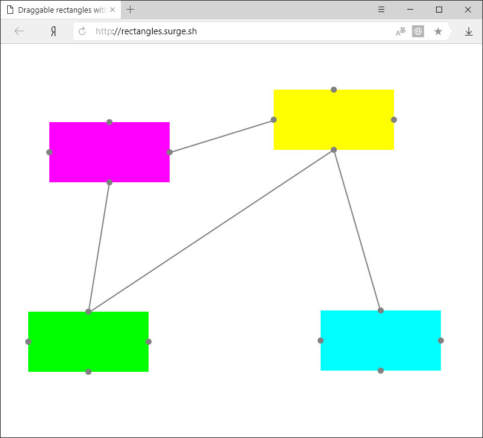

[](https://travis-ci.org/fortymorgan/getITtest)
# Тестовое задание Get IT
Тестовое задание для Get IT бизнес консалтинг.

[In English](README.en.md)

## Ссылка на приложение
https://get-it-test.surge.sh

## Описание задания
Разработать программу, которая по двойному нажатию мыши на экране добавляет прямоугольники разного цвета.  
Пряумоугольники добавляются в то место, где было произведено двойное нажатие.  
Прямоугольники можно перетаскивать по экрану.  
Между прямоугольниками можно создавать/удалять неограниченное количество связей.  
Прямоугольники не могут перекрывать друг друга ни при перетаскивании, ни при создании.  
При перетаскивании связанных прямоугольников связь сохраняется.

## Скриншоты


## Разработка
Сначала надо создать `bundle.js`, выполнив команду:
```
npm run watch
```
Для запуска приложения локально открыть `dist/index.html`.

## Развертывание
Сначала надо установить [Surge](http://surge.sh)
```
npm install -g surge
```
Измените префикс домена в скрипте `deploy` файла `package.json`, затем выполните команду:
```
npm run deploy
```
Если это ваш первый запуск, Surge запросит email и пароль, а также создаст аккаунт.  
Затем проект будет развернут на домене, указанном в скрипте `deploy` файла `package.json`.  
(Если домен уже занят, Surge сообщит об ошибке).

## Тестирование

Тесты написаны с использованием [Jest](https://github.com/facebook/jest)

Запуск тестов осуществляется командой:
```
npm test
```
Сохраненные состояния приложения находятся в `__tests__/__assets__`.

## Использование

### Добавление блока
Дважды кликните по свободному месту, чтобы добавить блок. Если места недостаточно, блок не будет добавлен.

### Перемещение блока
Удерживайте левую кнопку мыши на блоке и переместите его в другое место.

### Добавление связи
Кликните мышью по точке на одной из сторон блока, затем кликните по точке другого блока.

### Удаление связи
Кликните по связи, чтобы удалить ее.

## Создано с использованием
- [React](https://github.com/facebook/react) - веб-фреймворк
- [Redux](https://github.com/reduxjs/redux) - менеджер состояния приложения
